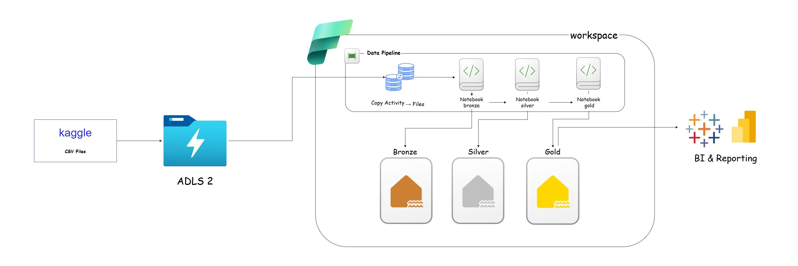
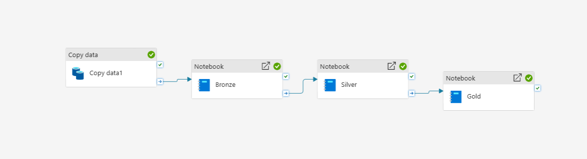

# End-to-End-Data-Engineering-Pipeline
A scalable end-to-end data pipeline built on Microsoft Fabric using Medallion Architecture to transform raw data into business-ready insights.

## Architecture

* **Bronze**: Raw data ingested via pipeline, then converted to Delta tables with schema enforcement
* **Silver**: Data cleaning, standardization, and transformations
* **Gold**: Business-ready tables using star schema

---

## Pipeline

Orchestrated using Microsoft Fabric Pipelines:

* Copy Activity → Ingest raw data from ADLS to Lakehouse
* Bronze Notebook → Apply schema and convert data to Delta tables
* Silver Notebook → Clean and transform data
* Gold Notebook → Aggregate and model data

---

## Processing

* PySpark (Fabric Notebooks)
* Delta Lake
* Layered processing (Bronze → Silver → Gold)

---

## Dataset

Olist dataset from Kaggle:
https://www.kaggle.com/datasets/olistbr/brazilian-ecommerce

---

